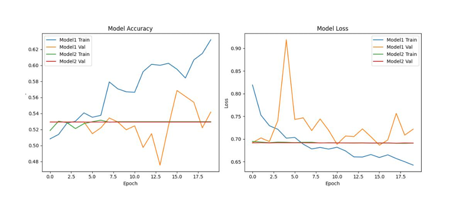
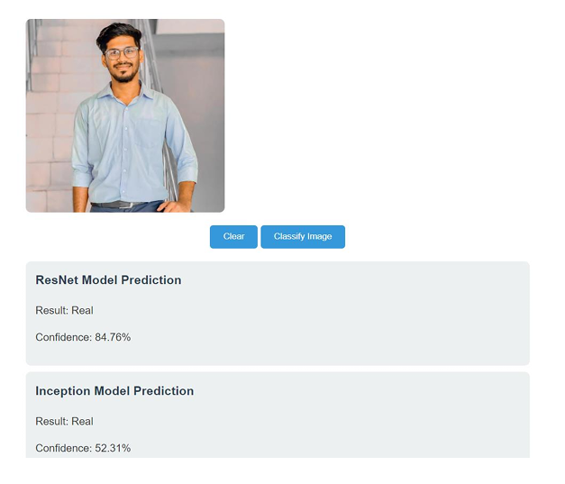
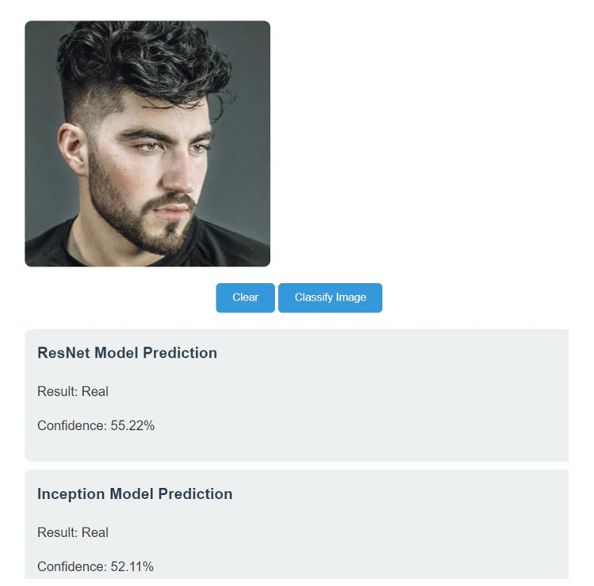
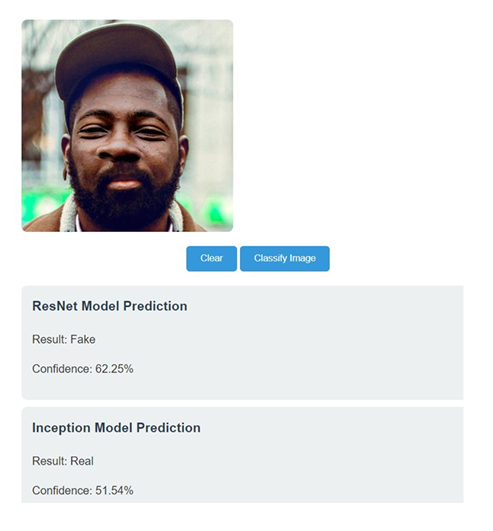

# Face Classification Project 🎭

[](https://www.python.org)
[](https://flask.palletsprojects.com/)
[](https://tensorflow.org)
[](https://huggingface.co/spaces/arsath-sm/face_classification)

A deep learning project for detecting and classifying real and artificially generated face images using ResNet and Inception architectures. 👤✨
<p align="center">
  
</p>

## 📋 Table of Contents
- [Overview](#overview)
- [Model Architecture](#model-architecture)
- [Performance](#performance)
- [Installation](#installation)
- [Usage](#usage)
- [Model Links](#model-links)
- [Future Improvements](#future-improvements)

## 🔍 Overview
This project implements two deep learning models to classify images as either real or AI-generated faces:
- **Model 1**: ResNet-based architecture with residual connections
- **Model 2**: Inception-style network with multi-scale feature processing

## 🏗️ Model Architecture

### ResNet Model (Model 1)
- Deep CNN with residual connections
- Handles vanishing gradient problem
- Effective for complex feature learning
- Multiple residual blocks with increasing filter sizes
- Dropout layers for regularization

### Inception Model (Model 2)
- Multi-scale feature processing
- Efficient computational design
- Parallel convolutional paths
- Adaptive to varying face sizes and orientations
- Better generalization capabilities

## 📊 Performance

| Model | Validation Accuracy | Validation Loss |
|-------|-------------------|----------------|
| ResNet | 52.45% | 0.7246 |
| Inception | 52.94% | 0.6913 |

<p align="center">
  
</p>
## 🚀 Installation

### 1. Set up Conda Environment
```bash
# Create new environment
conda create -p face python=3.9

# Activate environment
conda activate face

# Install requirements
pip install -r requirements.txt
```

### 2. Requirements
Create a `requirements.txt` file with:
```
Flask==2.1.0
tensorflow
numpy
opencv-python
pillow
```

## 💻 Usage
<p align="center">
  
</p>
<p align="center">
  
</p>
<p align="center">
  
</p>

### Running the Flask App
```bash
python app.py
```
Visit `http://localhost:5000` in your web browser to access the application.


## 🔗 Model Links

- [Model 1 on HuggingFace](https://huggingface.co/arsath-sm/face_classification_model1/tree/main)
- [Model 2 on HuggingFace](https://huggingface.co/arsath-sm/face_classification_model2/tree/main)
- [Demo Application](https://huggingface.co/spaces/arsath-sm/face_classification)
- [Flask Application Source](https://github.com/arsath-eng/face_classification.git)

## 🔄 Future Improvements

1. 📈 Data Quality
   - Investigate dataset biases
   - Enhance data diversity

2. 🔧 Model Architecture
   - Experiment with hybrid models
   - Implement transfer learning
   - Test ensemble methods

3. ⚡ Performance
   - Extended training periods
   - Hyperparameter optimization
   - Advanced data augmentation techniques

## 👥 Contributors
- Arsath S.M
- Faahiht K.R.M
- Arafath M.S.M

## 📄 License
This project is licensed under the MIT License - see the LICENSE file for details.

---
<p align="center">
Made with ❤️ at University of Jaffna Faculty of Engineering
</p>
